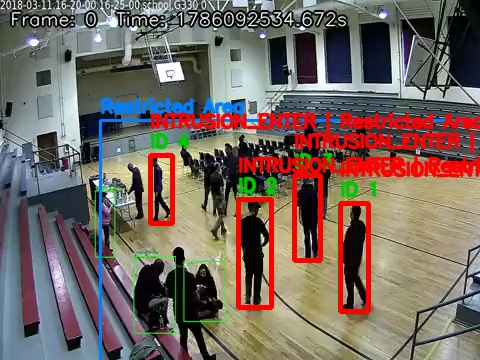

# AI Video Surveillance Pipeline

A production-style, modular AI video surveillance pipeline: person detection,
multi-object tracking, zone-based intrusion/loitering detection, event
aggregation, visual/structured output generation, and a REST API — built as
a sequence of independent, individually-tested modules.

```
Camera → VideoInput → FrameProcessor → PersonDetector → MultiObjectTracker
   → ZoneManager → IntrusionDetector → LoiteringDetector → EventEngine
   → OutputGenerator → FastAPI → REST APIs → (future) Dashboard
```

## Repository structure

```
src/surveillance/
├── api/                      # FastAPI backend (Prompt 12)
│   ├── routers/               # config, camera, events, outputs, system (+ health.py)
│   ├── services/               # business logic — routers only ever call these
│   ├── dependencies/            # DI container + Depends() providers, no globals
│   ├── schemas/                  # Pydantic response models (never expose pipeline dataclasses)
│   ├── middleware/                # request logging
│   └── exceptions/                 # ApiError hierarchy + global exception handlers
├── pipelines/                # one folder per pipeline stage, each self-contained:
│   ├── video_input/            # webcam / file / RTSP frame acquisition
│   ├── frame_processing/       # resize / color / normalize / frame-skip
│   ├── detection/              # YOLO person detection
│   ├── tracking/                # self-contained ByteTrack (Kalman + IoU/Hungarian)
│   ├── zones/                    # point-in-polygon zone membership (Shapely)
│   ├── intrusion/                 # ENTER/EXIT state machine per (track, zone)
│   ├── loitering/                   # dwell-time threshold detection
│   ├── events/                       # normalize/aggregate/filter/dedupe → SurveillanceEvent
│   └── output/                        # annotated video, snapshots, clips, JSON/CSV logs
│       # each pipeline package follows the same shape:
│       #   types.py (config dataclass) · exceptions.py · config.py (config.yaml loader)
│       #   <module>.py (main class) · __init__.py (public exports)
├── models/domain/             # framework-free, immutable domain models (frozen dataclasses) —
│                                the interchange contracts between every pair of modules above
└── core/                      # settings (.env), config.yaml loader, logging, constants

config/
├── config.yaml                # non-secret pipeline tuning (one section per module)
└── zones.yaml                 # zone polygon definitions

scripts/                      # one CLI smoke-test script per module (--demo flag = self-contained)
tests/
├── unit/                      # fast, no GPU/network required
└── integration/                # real YOLO inference + real files, marked `integration`

output/                       # runtime-generated artifacts (gitignored, see below)
sample_outputs/                # a small, committed set of example artifacts (see below)
```

Endpoints:
- `GET /` , `GET /health`
- `GET /api/v1/config`, `POST /api/v1/config/reload`
- `GET /api/v1/camera/status`
- `GET /api/v1/events`, `GET /api/v1/events/{event_id}`
- `GET /api/v1/outputs/latest/{video,snapshot,json,csv}`
- `GET /api/v1/system`

Full interactive docs at `/docs` once the server is running.

## Setup

Requires Python 3.9+ (this environment has 3.9.6; no newer interpreter was
available, so the project targets 3.9+ rather than 3.10+).

```bash
# Option A — helper script (creates .venv, installs deps, copies .env)
bash scripts/setup_env.sh          # runtime deps only
bash scripts/setup_env.sh --dev    # + test/lint tooling

# Option B — manual
python3 -m venv .venv
source .venv/bin/activate
pip install -r requirements.txt          # add -r requirements-dev.txt for tests/lint
cp .env.example .env
```

YOLO weights (`weights/yolov8n.pt`) are downloaded automatically by
`ultralytics` on first use if not already present.

## Run

```bash
source .venv/bin/activate
uvicorn src.main:app --reload --port 8001   # 8000 may already be in use locally
```

```bash
curl http://127.0.0.1:8001/health
curl http://127.0.0.1:8001/api/v1/events
open http://127.0.0.1:8001/docs             # Swagger UI
```

## Generating new outputs

The API is read-only: it exposes whatever `OutputGenerator` has already
written to `output/`, it never runs the pipeline itself. To actually produce
output, run any module's smoke-test script — `scripts/test_output_generator.py`
runs the *entire* pipeline end-to-end and writes every artifact type:

```bash
# Self-contained demo (bundled sample image looped into a short clip,
# low loitering threshold so both event types fire quickly)
python scripts/test_output_generator.py --demo --max-frames 50

# Or against your own video
python scripts/test_output_generator.py --source-type file --source data/input/your_video.mp4
```

This writes to `output/annotated_video/output.mp4`, `output/snapshots/`,
`output/clips/`, and `output/logs/{events.json,events.csv}`. By default,
each run first **cleans** `output/` of the previous run's artifacts
(`output.clean_previous_outputs: true` in `config.yaml`) — directories are
kept, only their contents are replaced — so results never mix runs. The
running API's own `OutputGenerator` is the one deliberate exception (it's
read-only and must not delete real output out from under itself), which is
why `POST /api/v1/config/reload` never touches `output/`.

Then fetch what was written through the API:
```bash
curl http://127.0.0.1:8001/api/v1/outputs/latest/video    -o output.mp4
curl http://127.0.0.1:8001/api/v1/outputs/latest/snapshot -o snapshot.jpg
curl http://127.0.0.1:8001/api/v1/outputs/latest/json
curl http://127.0.0.1:8001/api/v1/outputs/latest/csv
```

## `output/` vs `sample_outputs/`

- **`output/`** — where every real pipeline run writes its artifacts.
  Gitignored (only a `.gitkeep` is tracked) since it's regenerated by
  running the pipeline and would otherwise bloat the repo with binary
  video/image diffs on every run.
- **`sample_outputs/`** — a small, hand-picked, **committed** set of
  artifacts from one real pipeline execution, included specifically so
  this repository is reviewable on GitHub without anyone having to run
  the pipeline first. Nothing in the pipeline or the API reads from or
  writes to this folder — it exists purely for submission/reference.

```
sample_outputs/
├── annotated_video/
│   └── output.mp4          # full annotated run (bounding boxes, zone polygons, event labels)
├── clips/
│   ├── event_001.mp4       # 3 representative event clips (first / middle / last
│   ├── event_002.mp4       #   of the run, not just the first three consecutive
│   └── event_003.mp4       #   events, which would mostly overlap)
├── snapshots/
│   ├── event_001.jpg       # the matching snapshot for each clip above
│   ├── event_002.jpg
│   └── event_003.jpg
└── logs/
    ├── events.json         # the full event log from that run (all events, not just the 3 sampled)
    └── events.csv
```

### Example snapshot



A person entering `restricted_area` — bounding box, track ID, zone polygon,
event label, and frame/timestamp overlay are all drawn by `OutputGenerator`.

## Testing

```bash
# Unit tests — fast, no GPU/network
python -m pytest tests/unit -v

# Integration tests — real YOLO inference (auto-downloads weights on first run)
python -m pytest tests/integration -v -m integration

# Everything
python -m pytest -q
```

## Configuration

Two layers, intentionally separate:
- **`.env`** (copied from `.env.example`) — environment-specific values:
  device, video source, ports, log level. Never committed.
- **`config/config.yaml`** — non-secret pipeline tuning, one section per
  module (`video_input`, `frame_processing`, `detection`, `tracking`,
  `intrusion`, `loitering`, `events`, `output`, `logging`).
- **`config/zones.yaml`** — zone polygon definitions, reloadable at runtime
  via `POST /api/v1/config/reload` without restarting the API.

`core/settings.py` exposes a cached `get_settings()` singleton backed by
Pydantic, so environment variables are validated once at startup.

## Architecture notes

- **Framework-free domain models** (`models/domain/`) are the only thing
  passed between pipeline stages — no stage imports another stage's
  internals, only the domain models it needs.
- **Self-contained ByteTrack**: the tracking module implements its own
  Kalman filter + IoU/Hungarian matching rather than depending on
  `ultralytics.trackers`, so tracking logic is fully decoupled from the
  detector.
- **The FastAPI backend never re-runs the pipeline.** It's a thin
  read/status/reload layer over already-generated `output/` files and
  `config.yaml`/`zones.yaml` — it does not construct `PersonDetector` or
  `MultiObjectTracker` at all, matching `GET /api/v1/system`'s
  `modules_initialized` list.
